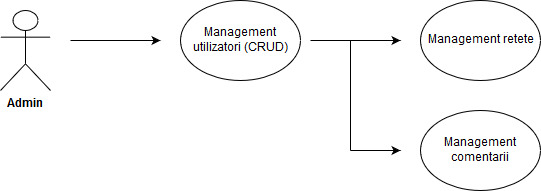
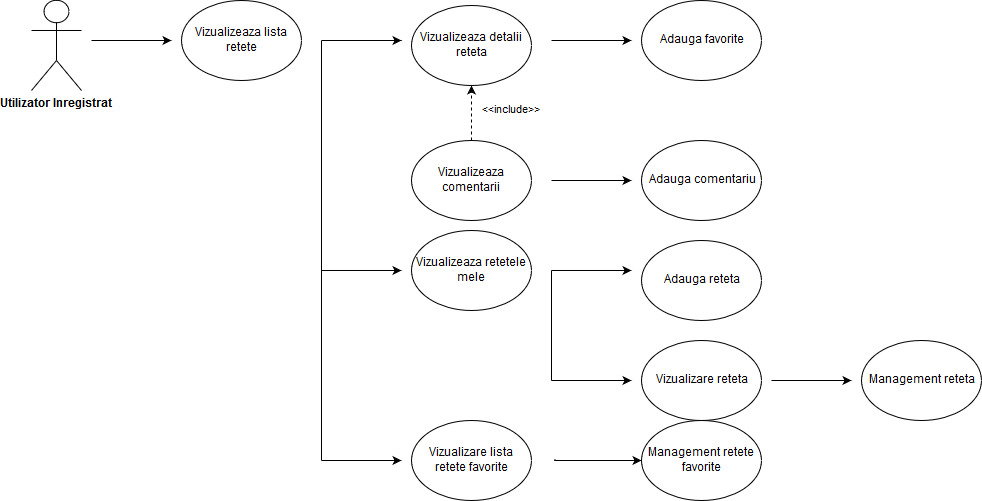
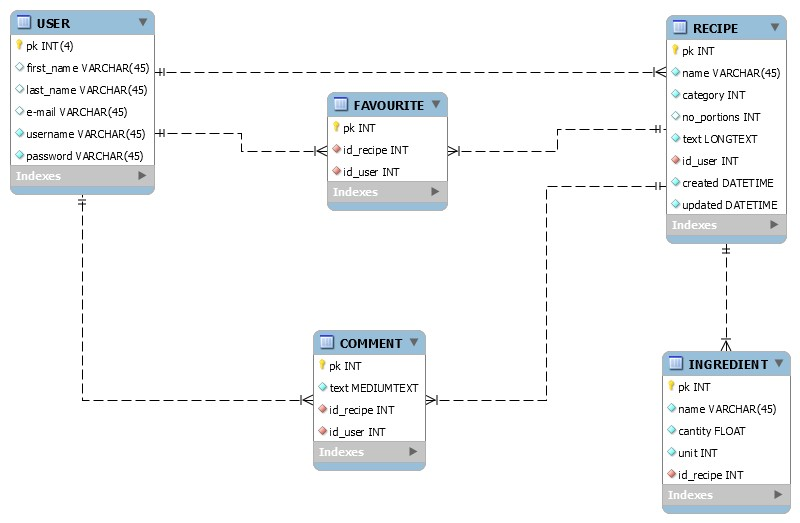

# virtual-recipe-box
 Proiectul reprezinta un forum de retete culinare. Exista doua tipuri de utilizatori: vizitatori si utilizatori autentificati.
Orice utilizator poate vizualiza retetele deja publicate, precum si comentariile adaugate la acestea. Doar utilizatorii autentificati pot adauga retete si comentarii la orice reteta. De asemenea, acestia pot adauga o reteta in lista de favorite si isi pot modifica sau sterge retetele deja publicate.
Administratorul poate crea membrii noi. Totodata, el poate sterge comentariile inadecvate sau retete. 

Diagrama cazurilor de utilizare: 

  

Figure 1-Cazuri de utilizare – administrator
Administratorul utilizează aplicația prin intermediul interfeței de administrare. Acesta poate administra toate retetele, utilizatorii și  comentariile.

 

  

Figure 2-Cazuri de utilizare – vizitator
Vizitatorul poate vizualiza lista retetelor. Pentru fiecare reteta poate vedea detalii si comentariile adaugate la aceasta.

  

 
Figure 3 - Cazuri de utilizare - Utilizator inregistrat

Utilizatorul inregistrat:
•	poate vizualiza lista de retete; pentru fiecare reteta acesta poate vizualiza detaliile si comentariile adaugate;
•	poate adauga comentarii la o reteta sau o poate adauga in lista retetelor favorite;
•	poate adauga retete, iar pentu retetele adaugate acesta poate vizualiza detalii, le poate sterge sau edita;
•	poate vizualiza lista reteteleor favorite si poate sterge din aceasta retetele ce nu mai sunt de interes. 

Schema bazei de date:

  

Figure 4 - Schema bazei de date
Aplicatia utilizeaza urmatoarele structuri fundamentale:

•	Recipe contine:
o	Nume – tip TEXT, obligatoriu
o	Categorie – tip CHOICE (variante disponibile: Desert, Fel principal, Aperitive/Salate, Supe), obligatoriu
o	Numar de portii – tip INT, optional
o	Id–ul utilizatorului ce a adaugat reteta – tip Fk, obligatoriu
o	Creat, Modificat – tip Date, obligatoriu

•	Comment contine:
o	Textul comentariului – tip TEXT, obligatoriu
o	Id-ul retetei la care a fost adaugat – tip FK, obligatoriu
o	Id-ul userului care a adaugat reteta – tip FK, obligatoriu

•	Ingredient contine:
o	Denumirea ingredientului – tip TEXT, obligatoriu
o	Cantitatea – tip FLOAT, obligatoriu
o	Unitate – tip CHOICE (variante: KG, Cana, Lingura, Lingurita, L, s.a.m.d.), obligatoriu
o	Id reteta – tip FK, obligatoriu

